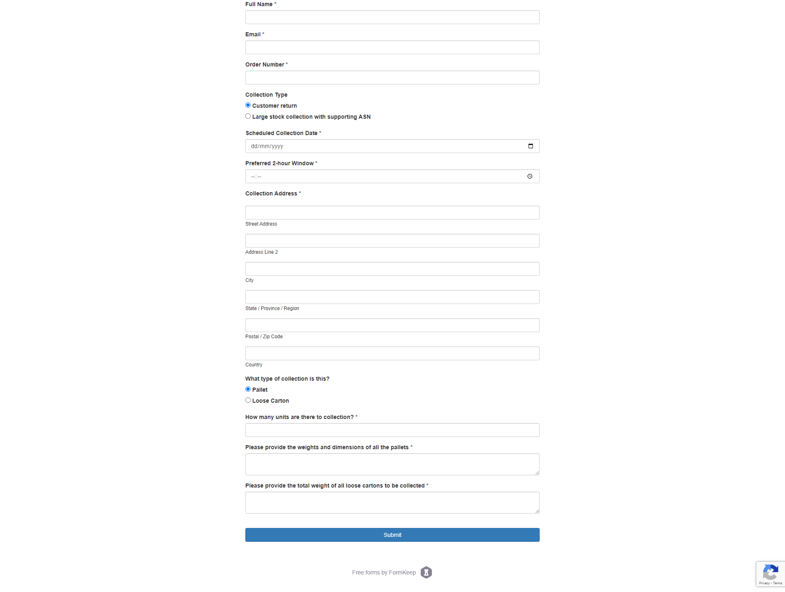

{} Collections from events cannot be arranged by Tu Pack. There are often very specific requirements that events impose on collections and deliveries, therefore it's best that you arrange the collection directly with the courier in order to ensure all details are passed along in a timely manner. {}

We are more than happy to arrange collections of stock, whether that be from a supplier, port, shops or your own studios please get in touch via the Success Portal to get a quote or using the form below. Please include the weights and dimensions of any collection so we can arrange the appropriate vehicle for collection. 

We'll always provide you with a quote first to ensure that you are happy with the price. There's no obligation to proceed with the collection upon quotation. 

If there are any requirements for a collection reference or specific paperwork we'll need these one day before the collection is due to take place. If we don't have the correct information and the courier is delayed or cannot pick up stock, there may still be costs incurred and Tu Pack will not cover these costs for you.

