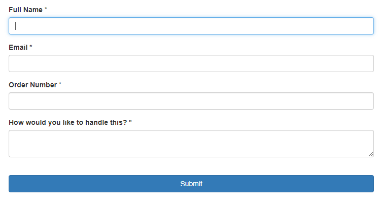

If we receive a return that contains damaged goods we will process the return on Mintsoft in order to notify you that this item is damaged. The notification should include an image of the damage, in order to help you inform your decision regarding the next steps. 

 

Any damaged goods will be placed into the damaged location at the warehouse, there is a 25p charge per unit per week. 

 

When you decide what you would like to do with your damaged goods, please let us know by submitting a Work Order. Please make sure to include the order number, SKU and quantity on submission.

